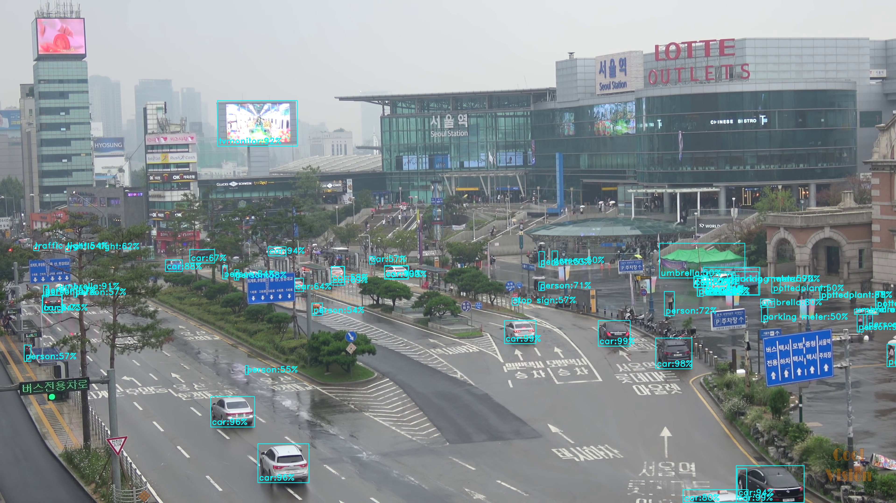

# F2B

## Frame Too Big

So we slice and dice, infer, then merge them back.

### Before f2b

If you just stuff a 4K image into a detector:

### After f2b

Just **purely slice, dice and infer**

After **deconflicting union** (at the overlapping regions)

**Final results!**

Just for comparison, here's the **no**-f2b version again..

## How to run

See `run.py` for example. Initialise, `register`, `detect`.

## Arguments

- `detect_fn` (`Callable`): object detection inference function
- `max_inference_width` and `max_inference_height` (`int`): usually the size your detector will shrink ur oversized image to, in pixels
- `overlapx_px` and `overlapy_px` (`int`): overlapping regions, in pixels
- `pad` (`bool`): if we add pad to orphan slices, probably don't pad for faster rcnn

## WIP

DCU aka deconflicting unions aka how to merge output boxes at overlapping slices.
